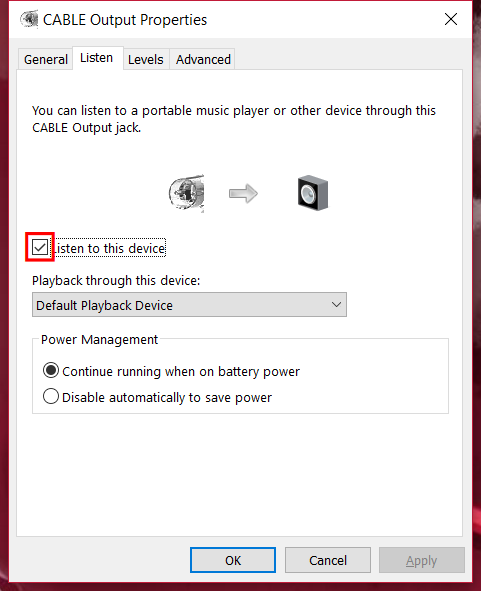
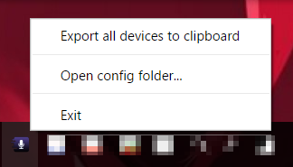

anyss
====

Any game sound selector for sending to voice chat.

Note: This project is under experiment. It may change user interface, config.json format, and/or others when updated.

TL;DR
----

Create combination of **Any modifier key** + **Any combination key** for selecting **Any your :speaker: sound file**

and **type Voice Chat key** on your game **to play your :speaker: sound file**

Requirement
----

- Work with Windows only
- Any virtual audio cable driver
    - [Virtual Audio Cables](https://www.vb-audio.com/Cable/index.htm)
    - [NETDUETTO](http://netduetto.net/download/)

Setup
----

1. Prepare your sound file like .wav, .mp3, .ogg, or .opus
2. Open your virtual audio cable device property and set **Listen to this device**  

3. **Remember** to set your virtual audio cable device to voice chat device on your game
4. Launch anyss.exe
5. Right-click tray icon  

6. Click **Export all devices to clipboard** and paste to your notepad
7. Click **Open config folder...**
8. Edit **config.json**

Usage
----

1. Launch your game
2. Push configured **modifier key** + **combination key**
3. Push VC key on your game
4. **Your sound will flow to Voice Chat!**
